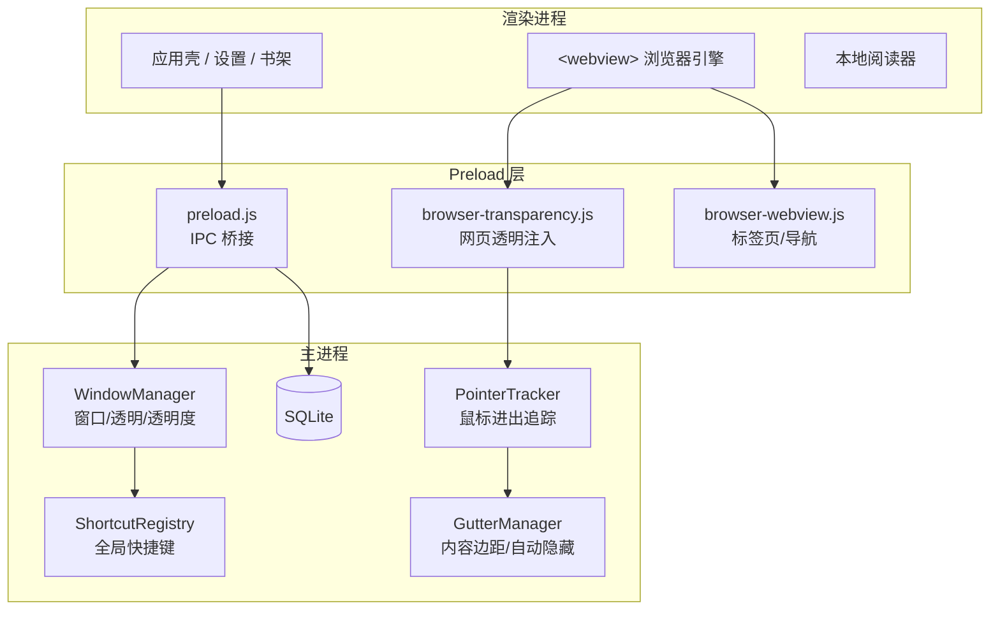
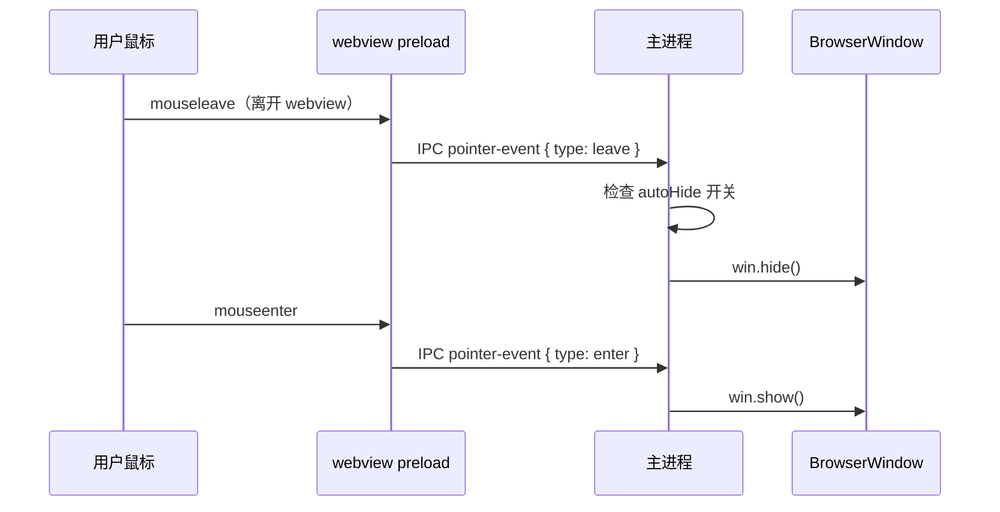

# Stealth Reader 设计文档

> **版本**：v0.2  
> **日期**：2026-07-06  
> **定位**：Windows 自用  
> **目的**：约束产品边界与技术路线，防止后期功能膨胀或架构走偏

---

## 0. 核心原则（最高优先级）

> **不必做跨平台、会员、自动更新、代码签名，专注把核心体验做好即可。**

本项目的全部投入应围绕 **「隐蔽阅读是否好用」**，而不是「产品是否完整/可商业化」。

### 0.1 只做这四件事

| 核心体验 | 含义 | 衡量标准 |
|----------|------|----------|
| **看得清** | 透明模式下文字可读、布局不崩 | 微信读书连续阅读 30 分钟无眼疲劳 |
| **藏得快** | 老板键 / 自动隐藏零延迟、零失误 | 100 次隐藏/恢复无一次失效 |
| **调得顺** | 窗口/内容透明度、URL 切换流畅 | 滑块拖动实时生效，重启后设置保留 |
| **读得到** | 网页 + 本地书（P1）都能打开 | 常用站点 + TXT/EPUB/PDF 正常阅读 |

### 0.2 永久不做

以下事项**即使「以后可能有用」也不做**，避免分散精力：

- 跨平台（macOS / Linux / 国产系统适配层）
- 会员 / 支付 / 登录 / 账号同步
- 自动更新（`electron-updater`）、官网运营、备案
- 代码签名、应用商店、安装器美化
- 社交、团队、AI、TTS 等非核心增值

### 0.3 开发资源分配

```
核心体验（透明 + 隐藏 + 浏览 + 阅读）  ≥ 80% 时间
体验打磨（误触修复、站点适配）          ≥ 15% 时间
其他（UI 美化、打包、文档）             ≤  5% 时间
```

---

## 1. 项目定位

### 1.1 一句话定义

**Stealth Reader** 是一款运行在 Windows 上的桌面工具，让用户在办公场景下以低存在感的方式浏览网页或阅读本地文档。

### 1.2 核心用户场景

| 场景 | 描述 | 优先级 |
|------|------|--------|
| 网页摸鱼 | 打开微信读书、B 站、刷题网站等 | P0 |
| 快速隐藏 | 老板键 / 鼠标移出后瞬间消失 | P0 |
| 透明融入 | 窗口与网页内容可调透明度，融入桌面 | P0 |
| 本地阅读 | 导入 TXT / EPUB / PDF 离线看 | P1 |
| 书架管理 | 记录进度、书签、最近打开 | P1 |

### 1.3 明确不做（Non-Goals）

以下功能**不在本项目范围内**，任何后续需求需对照本节，避免走偏：

| 不做 | 原因 |
|------|------|
| macOS / Linux 正式支持 | 自用仅 Windows，跨平台成本过高 |
| 会员 / 支付 / 账号体系 | 自用无需商业化 |
| 自动更新 / 官网 / 备案 | 自用本地构建即可 |
| 代码签名 / 应用商店上架 | 非发布场景 |
| 内置书源 / 盗版资源 | 法律风险 |
| 社交 / 团队协作 | 与自用场景无关 |
| AI 助手 / TTS 等增值功能 | 第二期以后单独评估，不混入 MVP |
| 替代 Chrome 的完整浏览器 | 只做「够用」的浏览壳，不做扩展生态 |

> **决策原则**：新功能必须回答「这对 Windows 自用隐蔽阅读有直接帮助吗？」——否则拒绝或延后。

---

## 2. 技术架构要点

### 2.1 技术栈

| 层级 | 选型 |
|------|------|
| 桌面壳 | Electron |
| 前端 | React + 轻量 CSS |
| 状态 | Zustand（P1 引入） |
| 本地存储 | MVP 用 JSON → P1 迁移 SQLite |
| 校验 | Zod（IPC 与配置校验） |
| 打包 | electron-builder（win portable），无签名 |
| EPUB | foliate-js（P1） |
| PDF | pdfjs-dist（P1） |
| TXT | chardet + iconv-lite（P1） |

### 2.2 架构要点



**关键设计模式（必须沿用）：**

1. **主进程管窗口，渲染进程管 UI** — 不在 React 里直接操作 `BrowserWindow`
2. **每种 webview 能力独立 preload** — 透明注入、右键菜单、导航逻辑分离
3. **IPC 通道有 Schema 校验** — 用 Zod 定义全部 channel，防止参数漂移
4. **透明分两层** — 窗口级 `setOpacity` + 网页级 CSS 注入，二者独立调节
5. **透明分两层** — 窗口级 `setOpacity` + 网页级 CSS 注入，二者独立调节
6. **仅 Windows 策略** — 不抽象跨平台层，直接按 Win10/11 行为调优
7. **Pointer 事件驱动自动隐藏** — preload 监听 mouseenter/leave，IPC 上报主进程

### 2.3 暂不做的模块

| 模块 | 说明 | 处理 |
|------|------|------|
| PasswordLockManager | 密码锁屏 | 不做 |
| TeamTray | 团队托盘社交 | 不做 |
| RenderModeCorrection | 渲染模式校正窗口 | 不做 |
| WebCache 管理 | 站点缓存清理 | P2 简化版 |
| electron-updater | 自动更新 | 不做 |
| 多语言 i18n | 完整国际化 | 仅中文 |

---

## 3. 产品需求

### 3.1 功能需求矩阵

#### P0 — MVP（必须完成）

| ID | 功能 | 验收标准 |
|----|------|----------|
| F-01 | 无边框透明窗口 | 可拖拽、可缩放，背景透明 |
| F-02 | 网页浏览 | 输入 URL 打开，支持微信读书等常见站 |
| F-03 | 窗口透明度 | 滑块 20–100%，实时生效，重启后保留 |
| F-04 | 内容透明度 | 仅影响 webview 内网页，与窗口透明度独立 |
| F-05 | 网页透明模式 | 注入 CSS 使页面背景透明 |
| F-06 | 老板键 | 默认 `Ctrl+Shift+H`，隐藏/显示窗口 |
| F-07 | 鼠标移出隐藏 | 可开关，移出窗口区域后 hide |
| F-08 | 设置持久化 | 保存到 `%APPDATA%/stealth-reader/settings.json` |
| F-09 | 快捷站点 | 首页预设 3–5 个常用 URL |

#### P1 — 核心体验延伸（本地阅读）

> 仅在 P0 稳定后再做。不做多标签、不做复杂 UI 框架升级。

| ID | 功能 | 验收标准 |
|----|------|----------|
| F-10 | 置顶开关 | 窗口 alwaysOnTop 可切换 |
| F-11 | 系统托盘 | 最小化到托盘，右键退出 |
| F-12 | TXT 阅读 | 导入、编码自动检测、分页 |
| F-13 | EPUB 阅读 | 目录、进度、字体大小 |
| F-14 | PDF 阅读 | 翻页、缩放 |
| F-15 | 书架 | 列表、删除、最近打开 |
| F-16 | SQLite 迁移 | 书架/进度/书签入库 |
| F-17 | 微信读书透明适配 | 作为站点适配样板，非追求全站兼容 |

#### P2 — 有余力再做

| ID | 功能 | 备注 |
|----|------|------|
| F-18 | 多标签页 | 非核心，单页够用则不做 |
| F-19 | 自动滚动 | 网页/TXT 自动翻页 |
| F-20 | portable 打包 | 本地 `npm run build`，无签名 |
| F-21 | 更多站点适配 | 按需逐个加，不做通用引擎 |

### 3.2 非功能需求

| 类别 | 要求 |
|------|------|
| 性能 | 启动 < 3s，内存 < 300MB（单标签） |
| 稳定性 | 老板键 100% 可靠，不因焦点问题失效 |
| 安全 | `contextIsolation: true`，`nodeIntegration: false` |
| 隐私 | 数据仅存本地，不上传 |
| 兼容 | Windows 10 / 11 x64 |

---

## 4. 技术架构

### 4.1 目录结构（目标态）

```
stealth-reader/
├── docs/
│   └── DESIGN.md              # 本文档
├── src/
│   ├── main/                  # 主进程
│   │   ├── index.ts           # 入口
│   │   ├── window/            # 窗口管理
│   │   ├── shortcuts/         # 全局快捷键
│   │   ├── pointer/           # 自动隐藏追踪
│   │   ├── ipc/               # IPC 注册 + Schema
│   │   └── settings/          # 配置读写
│   ├── preload/
│   │   ├── index.ts           # 渲染进程桥接
│   │   ├── types.ts           # 共享类型
│   │   └── browser-transparency.ts  # webview 透明注入
│   └── renderer/
│       ├── index.html
│       └── src/
│           ├── App.tsx
│           ├── components/    # UI 组件
│           ├── stores/        # Zustand
│           └── pages/         # 浏览器 / 书架 / 设置
├── electron.vite.config.ts
└── package.json
```

### 4.2 进程职责边界

| 进程 | 职责 | 禁止 |
|------|------|------|
| **Main** | 窗口生命周期、全局快捷键、文件 IO、数据库 | 直接操作 DOM |
| **Preload** | IPC 桥接、webview 脚本注入 | 业务逻辑过重 |
| **Renderer** | UI 渲染、用户交互 | 直接 require Node 模块 |

### 4.3 透明机制设计（核心）

双层透明方案：

```
用户看到的最终效果 = 窗口透明度 × 网页内容透明度 × 网页背景透明 CSS
```

| 层级 | API / 手段 | 控制方 |
|------|-----------|--------|
| L1 窗口 | `BrowserWindow.setOpacity(0~1)` | 主进程 |
| L2 窗口背景 | `setBackgroundColor('#00000000')` + `transparent: true` | 主进程 |
| L3 网页背景 | preload 注入 CSS，`background: transparent !important` | webview preload |
| L4 网页内容 | `document.documentElement.style.opacity` | webview preload |

**Windows 平台策略（固定，不随功能改动）：**

- 窗口：`transparent: true`，`hasShadow: true`
- 网页：legacy 全透明 CSS（`* { background: transparent !important }` 慎用，优先精确选择器）
- 关键选择器：`html, body, #root, #app, #__next, main`

**透明模式约束：**

- 全屏 / 最大化时拒绝透明（`rejectedReason: maximized | fullscreen`）
- 非透明模式下禁用内容边距自动隐藏

### 4.4 自动隐藏机制



**注意：**

- 工具栏区域由 shell preload 单独监听
- 需处理 webview → 工具栏移动时的误触发（debounce 50–100ms 或检查 `relatedTarget`）
- 老板键隐藏后，鼠标移入窗口热区可恢复（可选，P1）

---

## 5. 数据模型

### 5.1 设置（Settings）

MVP 阶段 JSON 文件，P1 迁移时保持字段兼容：

```typescript
interface AppSettings {
  // 窗口
  windowOpacity: number       // 20-100，默认 92
  alwaysOnTop: boolean        // 默认 false

  // 透明
  contentOpacity: number      // 20-100，默认 100
  transparentMode: boolean    // 网页背景透明，默认 true

  // 行为
  autoHide: boolean           // 鼠标移出隐藏，默认 true
  bossKey: string             // 默认 "CommandOrControl+Shift+H"

  // 浏览
  lastUrl: string
  presetSites: PresetSite[]   // 用户自定义快捷站点

  // P1
  theme: 'dark' | 'light'
  startMinimized: boolean
}

interface PresetSite {
  id: string
  label: string
  url: string
  order: number
}
```

### 5.2 书架（P1，SQLite）

```sql
CREATE TABLE books (
  id          TEXT PRIMARY KEY,
  path        TEXT NOT NULL,
  title       TEXT NOT NULL,
  format      TEXT NOT NULL,  -- txt | epub | pdf
  cover       TEXT,
  added_at    INTEGER NOT NULL
);

CREATE TABLE reading_progress (
  book_id     TEXT PRIMARY KEY,
  position    TEXT NOT NULL,  -- 章节ID / 页码 / 字符偏移
  percent     REAL,
  updated_at  INTEGER NOT NULL,
  FOREIGN KEY (book_id) REFERENCES books(id)
);

CREATE TABLE bookmarks (
  id          TEXT PRIMARY KEY,
  book_id     TEXT NOT NULL,
  position    TEXT NOT NULL,
  note        TEXT,
  created_at  INTEGER NOT NULL,
  FOREIGN KEY (book_id) REFERENCES books(id)
);
```

---

## 6. IPC 契约

所有 IPC 通道必须在 `src/main/ipc/schema.ts` 用 Zod 定义，渲染进程通过 preload 暴露的类型化 API 调用。

### 6.1 MVP 通道

| Channel | 方向 | 参数 | 返回 |
|---------|------|------|------|
| `get-settings` | invoke | — | `AppSettings` |
| `save-settings` | invoke | `Partial<AppSettings>` | `AppSettings` |
| `set-window-opacity` | invoke | `number` | `void` |
| `set-content-opacity` | invoke | `number` | `void` |
| `toggle-visibility` | invoke | — | `boolean`（是否可见） |
| `get-webview-preload-path` | invoke | — | `string` |
| `pointer-event` | send | `{ type: 'enter' \| 'leave' }` | — |
| `window-minimize` | send | — | — |
| `window-maximize` | send | — | — |
| `window-close` | send | — | — |
| `content-opacity-changed` | event | `number` | — |

### 6.2 P1 扩展通道（预留，MVP 不实现）

| Channel | 用途 |
|---------|------|
| `browser-tab-*` | 多标签管理 |
| `books-import` | 导入本地书 |
| `books-list` | 书架列表 |
| `reader-get-progress` | 阅读进度 |

> **规则**：新增 IPC 必须先更新 Schema 和本文档，禁止在组件里直接 `ipcRenderer.invoke('xxx')` 裸字符串调用。

---

## 7. 分阶段路线图

### Phase 0 — 基础骨架 ✅（当前）

- [x] Electron + React + TypeScript 脚手架
- [x] 无边框透明窗口
- [x] 单 webview + URL 栏
- [x] 窗口/内容透明度滑块
- [x] 老板键 + 自动隐藏
- [x] JSON 设置持久化

### Phase 1 — 核心体验打磨（当前重点）

- [ ] 误触发 hide 修复（debounce）
- [ ] 微信读书透明适配（第一个站点样板）
- [ ] IPC Schema（Zod）
- [ ] 置顶开关
- [ ] 系统托盘（仅退出/显示，不做复杂菜单）

**Phase 1 完成标志**：微信读书可稳定透明阅读 30 分钟，老板键与自动隐藏零失误。

### Phase 2 — 本地阅读

- [ ] SQLite 引入
- [ ] TXT / EPUB / PDF 阅读器
- [ ] 书架 + 进度保存

**Phase 2 完成标志**：导入 3 本书，重启后进度正确恢复。

### Phase 3 — 按需可选

- [ ] 多标签（仅当单页明显不够用时）
- [ ] 自动滚动
- [ ] portable 打包（无签名）
- [ ] 其他站点透明适配

---

## 8. 防走偏检查清单

每次加功能前，逐项确认：

```
[ ] 是否直接提升「看得清 / 藏得快 / 调得顺 / 读得到」之一？
[ ] 是否属于 §0.2 永久不做项（跨平台/会员/更新/签名）？
[ ] 是否破坏了 Main / Preload / Renderer 职责边界？
[ ] 是否新增了未经 Schema 定义的 IPC 通道？
[ ] 透明/隐藏逻辑是否仍由主进程统一管理？
[ ] 能否在 3 天内独立完成和自测？
```

**任一项为「否」且涉及 §0.2，直接拒绝。**

---

## 9. 风险与对策

| 风险 | 影响 | 对策 |
|------|------|------|
| 网站 CSS 变化导致透明失效 | 高 | 维护站点适配表；提供「关闭透明」开关 |
| webview 自动隐藏误触发 | 中 | debounce + 仅边界离开触发 |
| Electron 内存占用高 | 中 | 限制标签数；不用的 webview 销毁 |
| 杀毒误报 | 低 | 自用添加 Defender 排除项 |
| 功能膨胀 | 高 | 严格对照 §1.3 Non-Goals 和 §8 检查清单 |
| EPUB/PDF 解析兼容性 | 中 | 优先支持常见格式；失败给出明确错误 |

---

## 10. 术语表

| 术语 | 含义 |
|------|------|
| 窗口透明度 | 整个 Electron 窗口的不透明度（含工具栏） |
| 内容透明度 | 仅 webview 内网页文字/图片的不透明度 |
| 透明模式 | 网页背景 CSS 透明，看到桌面壁纸 |
| 老板键 | 全局快捷键，一键隐藏/显示窗口 |
| 自动隐藏 | 鼠标移出窗口区域后自动 hide |
| preload | Electron 预加载脚本，桥接主进程与网页 |
| gutter | 窗口内容边距，用于精确控制可见区域 |

---

## 11. 文档维护

| 变更类型 | 更新要求 |
|----------|----------|
| 新增 P0/P1 功能 | 更新 §3.1 功能矩阵 |
| 新增 IPC 通道 | 更新 §6 + Schema 文件 |
| 架构调整 | 更新 §4 并说明原因 |
| 明确不做某功能 | 更新 §1.3 Non-Goals |
| 阶段完成 | 勾选 §7 路线图 |

**本文档随项目演进更新，版本号递增。重大方向变更需在本节留下变更记录。**

### 变更记录

| 版本 | 日期 | 说明 |
|------|------|------|
| v0.2 | 2026-07-06 | 确立「专注核心体验」原则，下调多标签/打包优先级，移除跨平台架构考量 |
| v0.2.1 | 2026-07-06 | 增加 electron-builder Windows dir 打包（`npm run dist`） |
| v0.1 | 2026-07-06 | 初版，Windows 自用定位 |
